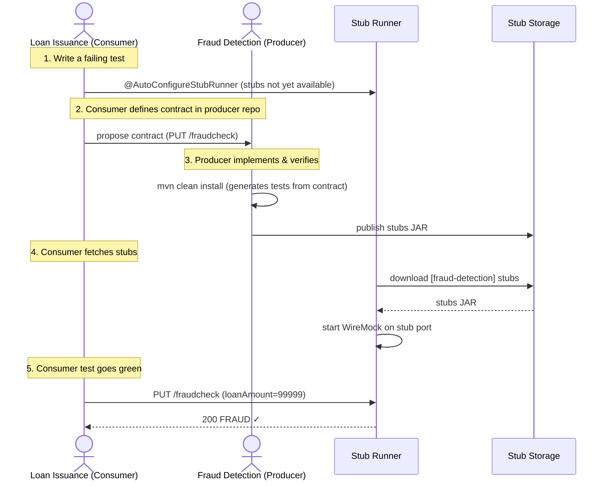

# Step-by-step Guide to Consumer Driven Contracts (CDC) with Contracts on the Producer Side

Consider an example of fraud detection and the loan issuance process. The business scenario is such that we want to issue loans to people but do not want them to steal from us. The current implementation of our system grants loans to everybody.

Assume that `Loan Issuance` is a client to the `Fraud Detection` server. In the current sprint, we must develop a new feature: if a client wants to borrow too much money, we mark the client as a fraud.

**Technical remarks:**

- Fraud Detection has an `artifact-id` of `http-server`.
- Loan Issuance has an `artifact-id` of `http-client`.
- Both have a `group-id` of `com.example`.
- For the sake of this example, the Stub Storage is Nexus/Artifactory.

**Social remarks:**

- Both the client and the server development teams need to communicate directly and discuss changes while going through the process.
- CDC is all about communication.

The server-side code is available under [Stubborn Contract Samples](https://github.com/stubborn-sh/stubborn-samples) repository `samples/standalone/dsl/http-server` path, and the client-side code is available under the `samples/standalone/dsl/http-client` path.

::: tip
In this case, the producer owns the contracts. Physically, all the contracts are in the producer's repository.
:::

## Technical Note

::: danger
All the code is available under the [Stubborn Contract Samples repo](https://github.com/stubborn-sh/stubborn-samples).
:::

For simplicity, we use the following acronyms:

- Loan Issuance (LI): The HTTP client
- Fraud Detection (FD): The HTTP server
- SCC: Stubborn Contract

## How CDC Works

The following diagram shows the full Consumer-Driven Contract flow between the Loan Issuance consumer and the Fraud Detection producer:



## The Consumer Side (Loan Issuance)

As a developer of the Loan Issuance service (a consumer of the Fraud Detection server), you might do the following steps:

1. Start doing TDD by writing a test for your feature.
2. Write the missing implementation.
3. Clone the Fraud Detection service repository locally.
4. Define the contract locally in the repository of the fraud detection service.
5. Add the Stubborn Contract (SCC) plugin.
6. Run the integration tests.
7. File a pull request.
8. Create an initial implementation.
9. Take over the pull request.
10. Write the missing implementation.
11. Deploy your application.
12. Work online.

### Start Doing TDD by Writing a Test for Your Feature

See the [LoanApplicationServiceTests.java](https://github.com/stubborn-sh/stubborn-samples/tree/main/standalone/dsl/http-client/src/test/java/com/example/loan/LoanApplicationServiceTests.java) example.

Assume that you have written a test of your new feature. If a loan application for a big amount is received, the system should reject that loan application with some description.

### Write the Missing Implementation

At some point in time, you need to send a request to the Fraud Detection service. Assume that you need to send the request containing the ID of the client and the amount the client wants to borrow. You want to send it to the `/fraudcheck` URL by using the `PUT` method.

See the [LoanApplicationService.java](https://github.com/stubborn-sh/stubborn-samples/tree/main/standalone/dsl/http-client/src/main/java/com/example/loan/LoanApplicationService.java) example.

For simplicity, the port of the Fraud Detection service is set to `8080`, and the application runs on `8090`.

::: info
If you start the test at this point, it breaks, because no service currently runs on port `8080`.
:::

### Clone the Fraud Detection Service Repository Locally

You can start by playing around with the server side contract. To do so, you must first clone it:

```bash
$ git clone https://your-git-server.com/server-side.git local-http-server-repo
```

### Define the Contract Locally in the Repository of the Fraud Detection Service

As a consumer, you need to define what exactly you want to achieve. You need to formulate your expectations. To do so, write the following contract:

::: danger
Place the contract in the `src/test/resources/contracts/fraud` folder. The `fraud` folder is important because the producer's test base class name references that folder.
:::

See the contract examples:

- [Groovy contract](https://github.com/stubborn-sh/stubborn-samples/tree/main/standalone/dsl/http-server/src/test/resources/contracts/fraud/shouldMarkClientAsFraud.groovy)
- [YAML contract](https://github.com/stubborn-sh/stubborn-samples/tree/main/standalone/dsl/http-server/src/test/resources/contracts/yml/fraud/shouldMarkClientAsFraud.yml)

The YML contract is quite straightforward. However, when you take a look at the contract written with a statically typed Groovy DSL, you might wonder what the `value(client(...), server(...))` parts are. By using this notation, Stubborn Contract lets you define parts of a JSON block, a URL, or other structure that is dynamic. In the case of an identifier or a timestamp, you need not hardcode a value. You want to allow some different ranges of values. To enable ranges of values, you can set regular expressions that match those values for the consumer side.

::: tip
To set up contracts, you must understand the map notation. See the [Groovy docs regarding JSON](https://groovy-lang.org/json.html).
:::

The previously shown contract is an agreement between two sides that:

If an HTTP request is sent with all of:
- A `PUT` method on the `/fraudcheck` endpoint
- A JSON body with a `client.id` that matches the regular expression `[0-9]{10}` and `loanAmount` equal to `99999`
- A `Content-Type` header with a value of `application/vnd.fraud.v1+json`

Then an HTTP response is sent to the consumer that:
- Has status `200`
- Contains a JSON body with the `fraudCheckStatus` field containing a value of `FRAUD` and the `rejectionReason` field having a value of `Amount too high`
- Has a `Content-Type` header with a value of `application/vnd.fraud.v1+json`

### Add the Stubborn Contract Verifier Plugin

We can add either a Maven or a Gradle plugin. First, we add the Stubborn Contract BOM. See the [full pom.xml example](https://github.com/stubborn-sh/stubborn-samples/tree/main/standalone/dsl/http-server/pom.xml).

Since the plugin was added, you get the Stubborn Contract Verifier features, which from the provided contracts:

- Generate and run tests
- Produce and install stubs

You do not want to generate tests, since you, as the consumer, want only to play with the stubs. You need to skip the test generation and invocation. To do so, run the following commands:

```bash
$ cd local-http-server-repo
$ ./mvnw clean install -DskipTests
```

Once you run those commands, you should see something like the following content in the logs:

```bash
[INFO] --- stubborn-contract-maven-plugin:1.0.0.BUILD-SNAPSHOT:generateStubs (default-generateStubs) @ http-server ---
[INFO] Building jar: /some/path/http-server/target/http-server-0.0.1-SNAPSHOT-stubs.jar
...
[INFO] Installing /some/path/http-server/target/http-server-0.0.1-SNAPSHOT-stubs.jar to /path/to/your/.m2/repository/com/example/http-server/0.0.1-SNAPSHOT/http-server-0.0.1-SNAPSHOT-stubs.jar
```

The following line is extremely important:

```bash
[INFO] Installing /some/path/http-server/target/http-server-0.0.1-SNAPSHOT-stubs.jar to /path/to/your/.m2/repository/com/example/http-server/0.0.1-SNAPSHOT/http-server-0.0.1-SNAPSHOT-stubs.jar
```

It confirms that the stubs of the `http-server` have been installed in the local repository.

### Running the Integration Tests

In order to profit from the Stubborn Contract Stub Runner functionality of automatic stub downloading, you must do the following in your consumer side project (Loan Application service):

1. Add the Stubborn Contract BOM. See the [full pom.xml example](https://github.com/stubborn-sh/stubborn-samples/tree/main/standalone/dsl/http-client/pom.xml).
2. Add the dependency to Stubborn Contract Stub Runner.
3. Annotate your test class with `@AutoConfigureStubRunner`. In the annotation, provide the `group-id` and `artifact-id` for the Stub Runner to download the stubs of your collaborators. See the [LoanApplicationServiceTests.java example](https://github.com/stubborn-sh/stubborn-samples/tree/main/standalone/dsl/http-client/src/test/java/com/example/loan/LoanApplicationServiceTests.java).
4. (Optional) Because you are playing with the collaborators offline, you can also provide the offline work switch (`StubRunnerProperties.StubsMode.LOCAL`).

Now, when you run your tests, you see something like the following output in the logs:

```bash
2016-07-19 14:22:25.403  INFO 41050 --- [main] o.s.c.c.stubrunner.AetherStubDownloader  : Desired version is + - will try to resolve the latest version
2016-07-19 14:22:25.438  INFO 41050 --- [main] o.s.c.c.stubrunner.AetherStubDownloader  : Resolved version is 0.0.1-SNAPSHOT
...
2016-07-19 14:22:27.737  INFO 41050 --- [main] o.s.c.c.stubrunner.StubRunnerExecutor    : All stubs are now running RunningStubs [namesAndPorts={com.example:http-server:0.0.1-SNAPSHOT:stubs=8080}]
```

This output means that Stub Runner has found your stubs and started a server for your application with a group ID of `com.example` and an artifact ID of `http-server` with version `0.0.1-SNAPSHOT` of the stubs and with the `stubs` classifier on port `8080`.

### Filing a Pull Request

What you have done until now is an iterative process. You can play around with the contract, install it locally, and work on the consumer side until the contract works as you wish.

Once you are satisfied with the results and the test passes, you can publish a pull request to the server side. Currently, the consumer side work is done.

## The Producer Side (Fraud Detection server)

As a developer of the Fraud Detection server (a server to the Loan Issuance service), you might want to:

- Take over the pull request
- Write the missing implementation
- Deploy the application

### Taking over the Pull Request

See the initial implementation: [FraudDetectionController.java](https://github.com/stubborn-sh/stubborn-samples/tree/main/standalone/dsl/http-server/src/main/java/com/example/fraud/FraudDetectionController.java).

Then you can run the following commands:

```bash
$ git checkout -b contract-change-pr master
$ git pull https://your-git-server.com/server-side-fork.git contract-change-pr
```

In the configuration of the Maven plugin, you must pass the `packageWithBaseClasses` property. See the [full pom.xml example](https://github.com/stubborn-sh/stubborn-samples/tree/main/standalone/dsl/http-server/pom.xml).

::: danger
This example uses "convention-based" naming by setting the `packageWithBaseClasses` property. Doing so means that the two last packages combine to make the name of the base test class. In our case, the contracts were placed under `src/test/resources/contracts/fraud`. Since you do not have two packages starting from the `contracts` folder, pick only one, which should be `fraud`. Add the `Base` suffix and capitalize `fraud`. That gives you the `FraudBase` test class name.
:::

All the generated tests extend that class. Over there, you can set up your Spring Context or whatever is necessary. In this case, you should use [Rest Assured MVC](https://github.com/rest-assured/rest-assured) to start the server side `FraudDetectionController`.

See the [FraudBase.java example](https://github.com/stubborn-sh/stubborn-samples/tree/main/standalone/dsl/http-server/src/test/java/com/example/fraud/FraudBase.java).

Now, if you run `./mvnw clean install`, you get something like the following output:

```bash
Results:

Tests in error:
  ContractVerifierTest.validate_shouldMarkClientAsFraud:32 » IllegalState Parsed...
```

This error occurs because you have a new contract from which a test was generated, and it failed since you have not implemented the feature. The auto-generated test looks like the following:

```java
@Test
public void validate_shouldMarkClientAsFraud() throws Exception {
    // given:
        MockMvcRequestSpecification request = given()
                .header("Content-Type", "application/vnd.fraud.v1+json")
                .body("{\"client.id\":\"1234567890\",\"loanAmount\":99999}");

    // when:
        ResponseOptions response = given().spec(request)
                .put("/fraudcheck");

    // then:
        assertThat(response.statusCode()).isEqualTo(200);
        assertThat(response.header("Content-Type")).matches("application/vnd.fraud.v1\\+json.*");
    // and:
        DocumentContext parsedJson = JsonPath.parse(response.getBody().asString());
        assertThatJson(parsedJson).field("['fraudCheckStatus']").matches("[A-Z]{5}");
        assertThatJson(parsedJson).field("['rejection.reason']").isEqualTo("Amount too high");
}
```

If you used the Groovy DSL, you can see that all the `producer()` parts of the Contract that were present in the `value(consumer(...), producer(...))` blocks got injected into the test. If you use YAML, the same applies for the `matchers` sections of the `response`.

Note that, on the producer side, you are also doing TDD. The expectations are expressed in the form of a test. This test sends a request to our own application with the URL, headers, and body defined in the contract. It is time to convert the `red` into the `green`.

### Write the Missing Implementation

Because you know the expected input and expected output, you can write the missing implementation. See the [FraudDetectionController.java](https://github.com/stubborn-sh/stubborn-samples/tree/main/standalone/dsl/http-server/src/main/java/com/example/fraud/FraudDetectionController.java) example.

When you run `./mvnw clean install` again, the tests pass. Since the Stubborn Contract Verifier plugin adds the tests to the `generated-test-sources`, you can actually run those tests from your IDE.

### Deploying Your Application

Once you finish your work, you can deploy your changes. To do so, you must first merge the branch by running the following commands:

```bash
$ git checkout master
$ git merge --no-ff contract-change-pr
$ git push origin master
```

Your CI might run a command such as `./mvnw clean deploy`, which would publish both the application and the stub artifacts.

## Consumer Side (Loan Issuance), Final Step

As a developer of the loan issuance service (a consumer of the Fraud Detection server), you need to:

- Merge your feature branch to `master`
- Switch to online mode of working

### Merging a Branch to Master

```bash
$ git checkout master
$ git merge --no-ff contract-change-pr
```

### Working Online

Now you can disable the offline work for Stubborn Contract Stub Runner and indicate where the repository with your stubs is located. At this moment, the stubs of the server side are automatically downloaded from Nexus/Artifactory. You can set the value of `stubsMode` to `REMOTE`.

See the [application-test-repo.yaml example](https://github.com/stubborn-sh/stubborn-samples/tree/main/standalone/dsl/http-client/src/test/resources/application-test-repo.yaml).

That's it. You have finished the tutorial.
