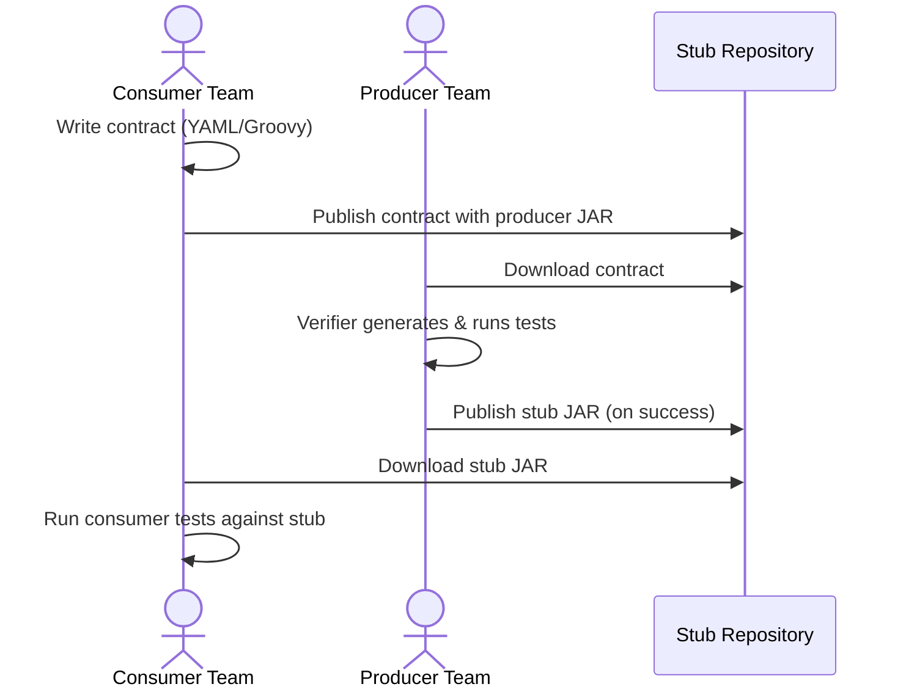

# Key Concepts

Before diving into the tutorials, here is a quick glossary of terms you will encounter throughout the Stubborn Contract documentation.

## Glossary

**Consumer**
The service that makes HTTP requests or receives messages from another service. The consumer *defines* what it expects — the contract — and tests against a stub so it doesn't need the real service running.

**Producer** (also: Provider)
The service that implements an API or publishes messages. The producer downloads the consumer's contracts and runs automatically-generated tests to prove it honours them.

**Contract**
A YAML or Groovy DSL file describing a single interaction: what request the consumer sends and what response the producer must return. Contracts live in the producer's repository (or a shared repository).

**Stub**
A WireMock-based fake HTTP server generated from a contract. The consumer runs its integration tests against the stub instead of the real service, making tests fast, reliable, and offline-capable.

**Stub Runner**
A component that downloads stub JARs (from Maven local cache, remote repository, or a Git repo) and starts them as local HTTP servers during consumer tests.

**Verifier**
The Maven or Gradle plugin that reads contract files and generates JUnit/Spock tests. When you run `mvn test`, the verifier executes those generated tests against your real application.

**CDC — Consumer-Driven Contracts**
A testing methodology where consumers define the API shape they need, and producers prove they satisfy it. The "driven" part means the consumer's contract drives what the producer must implement.

**WireMock**
An open-source HTTP stubbing library. Stubborn Contract generates WireMock JSON mapping files from your contracts — these are what get packaged into the stub JAR.

## The Full Workflow

## Next Steps

- [Quick Start (3 min)](./quick-start) — get your first contract working
- [First Application](./first-application) — step-by-step full walkthrough
- [Contract DSL](../reference/contract-dsl) — all the ways to write a contract
