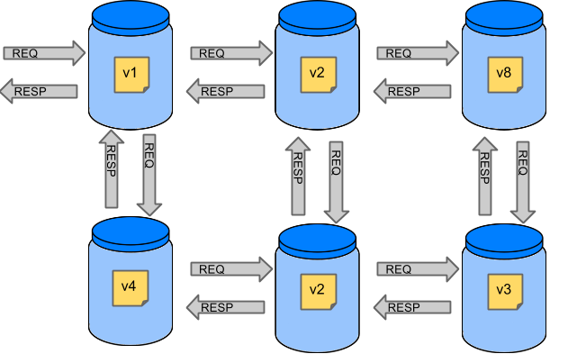
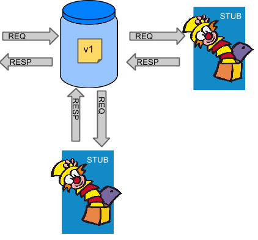

# Introduction to Stubborn Contract

Stubborn Contract moves TDD to the level of software architecture. It lets you perform consumer-driven and producer-driven contract testing.

## History

Before Stubborn Contract, this project was called [Accurest](https://github.com/Codearte/accurest). It was created by [Marcin Grzejszczak](https://twitter.com/mgrzejszczak) and [Jakub Kubrynski](https://twitter.com/jkubrynski).

The `0.1.0` release took place on 26 Jan 2015 and became stable with the `1.0.0` release on 29 Feb 2016.

In 2016, the project was donated to the Spring Cloud umbrella and became **Spring Cloud Contract**, where it was maintained as part of the Spring ecosystem for many years.

Stubborn Contract is the continuation of that work — led by the original creator, Marcin Grzejszczak — now independent of the Spring Cloud release train. It targets **Spring Boot 4.x / Spring Framework 7.x** and beyond, while remaining usable without Spring altogether.

The transition was announced on the [Spring blog](https://spring.io/blog/2026/07/06/spring-cloud-contract-transition-to-stubbornsh/) and on [Marcin's blog at toomuchcoding.com](https://toomuchcoding.com/post/2026-07-06-spring-cloud-contract-becomes-stubborn/).

## Stubborn Ecosystem

Stubborn Contract is part of the broader [Stubborn](https://stubborn.sh) platform, which also includes the **Stubborn Broker** — a managed contract and stub registry. The broker provides a central place to publish, discover, and share stubs across teams. See the [Stubborn Broker docs](https://stubborn.sh/docs) for details on integrating your contracts with the hosted service.

If you are migrating from Spring Cloud Contract, see the [migration guide](/migration/from-spring-cloud-contract).

## Why Do You Need It?

Assume you have a system composed of multiple microservices:

### Testing Issues

If you want to test your application in full, you can either:

- Deploy all microservices and perform end-to-end tests.
- Mock other microservices in unit and integration tests.

Both approaches have their advantages and disadvantages.

**Deploy all microservices and perform end-to-end tests**

Advantages:
- Simulates production.
- Tests real communication between services.

Disadvantages:
- To test one microservice, you must deploy all dependent microservices, databases, etc.
- The test run is locked for a single suite.
- You can go to production with passing tests but failing production behavior.

**Mock other microservices**

Advantages:
- Very fast feedback.
- No infrastructure dependencies for the CI/CD pipeline.

Disadvantages:
- The implementor of the stub may make it behave differently from the real service, giving false-positive test results.

That is why Stubborn Contract was created: to give you very fast feedback without needing to set up an entire microservice world. You work on stubs, and only the applications that your application directly uses need to be running.

Stubborn Contract ensures that the stubs you use were created by the service you call and that they were tested against the producer's side. You can trust those stubs.

## What Does Stubborn Contract Provide?

The main features of Stubborn Contract are:

- Ensure that HTTP and messaging stubs (used when developing the consumer side) do exactly what the actual server-side implementation does.
- Promote ATDD (Acceptance Test-Driven Development) and microservices architectural style.
- Provide a way to publish changes in contracts that are visible immediately on both sides.
- Generate boilerplate test code on the server side.

Stubborn Contract integrates with [WireMock](http://wiremock.org) as the HTTP server stub.

::: danger
Contracts must come from a **trusted source**. You should never download nor interact with contracts coming from untrusted locations.
:::

## The Purpose of Contracts

Stubborn Contract's purpose is NOT to start writing business features in contracts. Suppose a user can be flagged as a fraud for two reasons. You then have two contracts, one for the positive case and one for the negative case.

A contract is an agreement on what the API provides. Given the fraud detection example:

- A consumer sends a request containing the ID of a client company and the amount they want to borrow to the `/fraudcheck` URL using the `PUT` method.

[Click here to see a Groovy contract example](https://github.com/stubborn-sh/stubborn-samples/tree/main/standalone/dsl/http-server/src/test/resources/contracts/fraud/shouldMarkClientAsFraud.groovy)

[Click here to see a YAML contract example](https://github.com/stubborn-sh/stubborn-samples/tree/main/standalone/dsl/http-server/src/test/resources/contracts/yml/fraud/shouldMarkClientAsFraud.yml)
