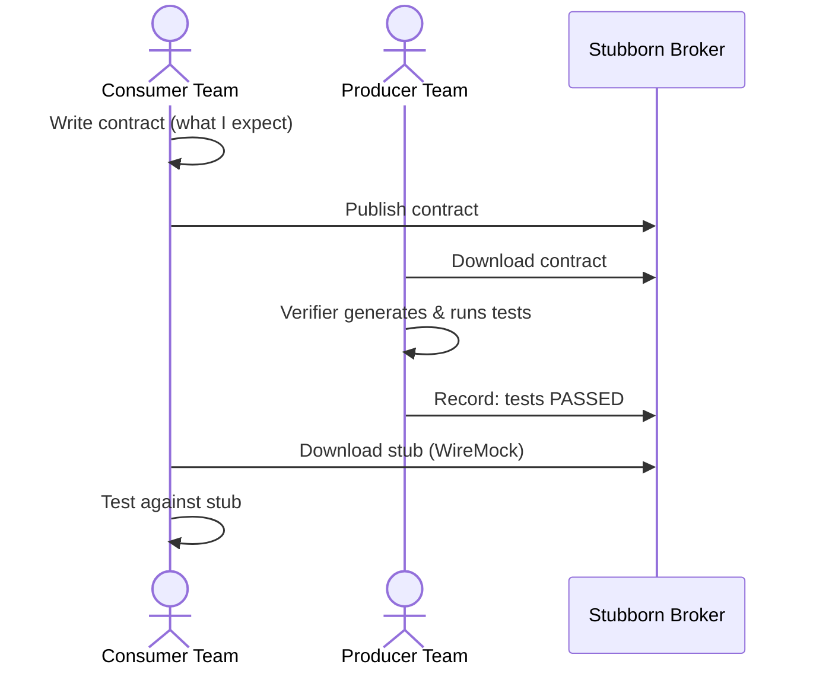

# Why Use Stubborn Contract?

## The Integration Testing Problem

Microservices communicate over HTTP and messaging. The traditional way to test this is:

- **End-to-end tests**: Spin up every service. Slow, fragile, hard to debug.
- **Mocks**: Fast, but the mock drifts from the real service over time — the test passes but production breaks.

Consumer-driven contract testing solves this with a third option: **verified stubs**.

## How It Works

The stub is **generated from the same contract the producer tested against** — so if the producer passes and the consumer passes, they are genuinely compatible.

## Compared to Alternatives

| | E2E Tests | Manual Mocks | Stubborn Contract |
|---|---|---|---|
| Speed | Slow (minutes) | Fast | Fast |
| Reliability | Flaky | Drifts silently | Verified |
| Who defines the contract | Nobody | Consumer (but not enforced) | Consumer (enforced by producer tests) |
| Works across teams | Yes | Requires coordination | Yes — broker handles it |
| Works for messaging | Yes | With effort | Yes |

## Why Stubborn Contract specifically?

- **Direct successor to Spring Cloud Contract 5.x** — if your team already has SCC contracts, they work without changes
- **No broker required to start** — contracts can live in the producer repo alongside the tests
- **Polyglot** — Java/Kotlin producer, Node.js consumer, or vice versa via Docker images and npm packages
- **Multiple formats** — YAML (human-readable), Groovy DSL (powerful), Java DSL (IDE-friendly)
- **Messaging support** — not limited to HTTP; supports Kafka, RabbitMQ, and Apache Camel out of the box
- **WireMock stubs** — the most widely-used HTTP stub server, with a rich ecosystem
- **Stub Runner** — stubs are downloaded automatically at runtime from a Maven repository, no manual wiring needed

## When not to use it

Contract testing works best when:
- There is a real consumer team that has opinions about the API shape
- The interaction is request/response (HTTP) or message-based (Kafka, JMS)

It is NOT a replacement for end-to-end smoke tests that verify the whole system is wired together correctly in production.
