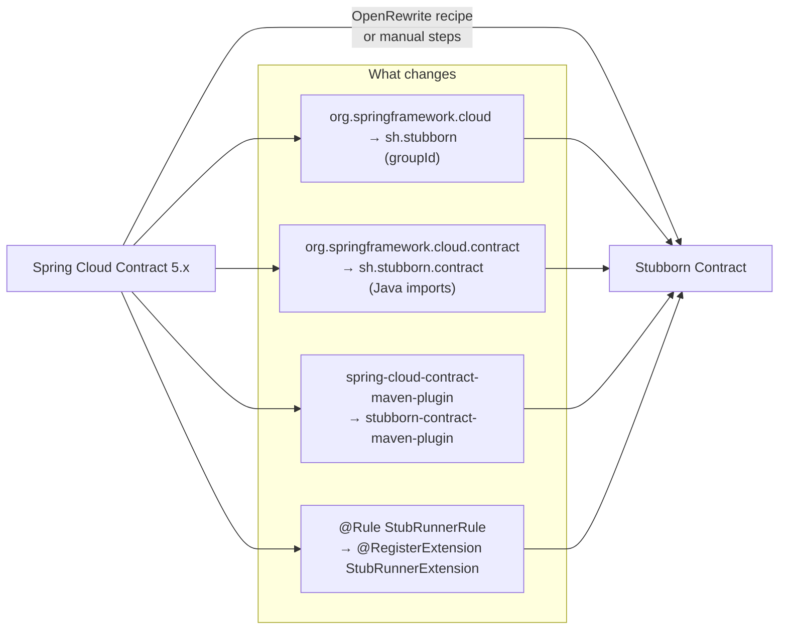

# Migrating from Spring Cloud Contract to Stubborn Contract

Stubborn Contract is the official continuation of Spring Cloud Contract. The migration is mostly mechanical — a set of find-and-replace operations across your `pom.xml` / `build.gradle` and Java imports.



---

## 0. Automated migration with OpenRewrite

The fastest path is to run the OpenRewrite recipe that automates steps 1–4 below:

```bash
./mvnw -U org.openrewrite.maven:rewrite-maven-plugin:run \
  -Drewrite.recipeArtifactCoordinates=sh.stubborn:stubborn-contract-migration:LATEST \
  -Drewrite.activeRecipes=sh.stubborn.contract.migration.MigrateFromSpringCloudContract
```

This composite recipe (`sh.stubborn.contract.migration.MigrateFromSpringCloudContract`) applies five sub-recipes:
- `sh.stubborn.contract.migration.UpdateDependencies` — replaces `org.springframework.cloud:spring-cloud-contract-*` GAVs (dependencies, the managed BOM, and the Maven/Gradle plugins) with their `sh.stubborn:stubborn-*` equivalents, in Maven and Gradle builds alike (Groovy and Kotlin DSL), repinning each to the latest published release
- `sh.stubborn.contract.migration.RenameJavaPackages` — renames `org.springframework.cloud.contract` → `sh.stubborn.contract`, and the assertion packages `com.toomuchcoding.jsonassert` → `sh.stubborn.jsonassert` and `com.toomuchcoding.xmlassert` → `sh.stubborn.xmlassert`
- `sh.stubborn.contract.migration.MigrateStubRunnerProperties` — renames `spring.cloud.contract.stubrunner.*` configuration keys to `stubborn.contract.stubrunner.*`
- `sh.stubborn.contract.migration.MigrateVerifierProperties` — renames `spring.cloud.contract.verifier.*` configuration keys to `stubborn.contract.verifier.*`
- `sh.stubborn.contract.migration.DropJUnit4Support` — changes `StubRunnerRule` / `StubRunnerClassRule` (JUnit 4) to `StubRunnerExtension` (JUnit 5)

After running, verify the changes and complete any remaining manual steps below.

---

## 1. Maven coordinates

| Spring Cloud Contract | Stubborn Contract |
|-----------------------|-------------------|
| `org.springframework.cloud:spring-cloud-starter-contract-verifier` | `sh.stubborn:stubborn-contract-starter-verifier` |
| `org.springframework.cloud:spring-cloud-starter-contract-stub-runner` | `sh.stubborn:stubborn-contract-starter-stub-runner` |
| `org.springframework.cloud:spring-cloud-contract-verifier` | `sh.stubborn:stubborn-contract-verifier` |
| `org.springframework.cloud:spring-cloud-contract-wiremock` | `sh.stubborn:stubborn-contract-wiremock` |
| `org.springframework.cloud:spring-cloud-contract-spec-java` | `sh.stubborn:stubborn-contract-spec-java` |
| `org.springframework.cloud:spring-cloud-contract-spec-groovy` | `sh.stubborn:stubborn-contract-spec-groovy` |
| `org.springframework.cloud:spring-cloud-contract-spec-kotlin` | `sh.stubborn:stubborn-contract-spec-kotlin` |
| `org.springframework.cloud:spring-cloud-contract-converters` | `sh.stubborn:stubborn-contract-converters` |
| `org.springframework.cloud:spring-cloud-contract-stub-runner` | `sh.stubborn:stubborn-contract-stub-runner` |
| `org.springframework.cloud:spring-cloud-contract-spec` | `sh.stubborn:stubborn-contract-spec` |
| `org.springframework.cloud:spring-cloud-starter-contract-stub-runner-jetty` | `sh.stubborn:stubborn-contract-starter-stub-runner-jetty` |
| `com.toomuchcoding.jsonassert:jsonassert` | `sh.stubborn:stubborn-contract-jsonassert` |
| `com.toomuchcoding.xmlassert:xmlassert` | `sh.stubborn:stubborn-contract-xmlassert` |

Version: use the current release, or a snapshot from:
```xml
<repository>
    <id>central-snapshots</id>
    <url>https://central.sonatype.com/repository/maven-snapshots/</url>
</repository>
```

---

## 2. Maven plugin

```xml
<!-- Before -->
<plugin>
    <groupId>org.springframework.cloud</groupId>
    <artifactId>spring-cloud-contract-maven-plugin</artifactId>
    <version>5.x.x</version>
    <extensions>true</extensions>
</plugin>

<!-- After -->
<plugin>
    <groupId>sh.stubborn</groupId>
    <artifactId>stubborn-contract-maven-plugin</artifactId>
    <version>${stubborn-contract.version}</version>
    <extensions>true</extensions>
</plugin>
```

---

## 3. Gradle plugin

```groovy
// Before
plugins {
    id 'org.springframework.cloud.contract' version '5.x.x'
}

// After
plugins {
    id 'sh.stubborn.contract' version "${verifierVersion}"
}
```

---

## 4. Java imports

Replace all occurrences of `org.springframework.cloud.contract` with `sh.stubborn.contract`.

```bash
# Quick grep to find all affected files
grep -r "org.springframework.cloud.contract" src/ --include="*.java" --include="*.groovy" --include="*.kt" -l
```

```java
// Before
import org.springframework.cloud.contract.spec.Contract;
import org.springframework.cloud.contract.verifier.messaging.boot.AutoConfigureMessageVerifier;
import org.springframework.cloud.contract.stubrunner.spring.AutoConfigureStubRunner;

// After
import sh.stubborn.contract.spec.Contract;
import sh.stubborn.contract.verifier.messaging.boot.AutoConfigureMessageVerifier;
import sh.stubborn.contract.stubrunner.spring.AutoConfigureStubRunner;
```

---

## 5. JUnit 4 rules → JUnit 5 extensions

Replace `@Rule` / `@ClassRule` with `@RegisterExtension`:

```java
// Before (JUnit 4)
@Rule
public StubRunnerRule stubRunnerRule = new StubRunnerRule()
    .downloadStub("com.example", "my-service")
    .repoRoot("classpath:m2repo/repository/")
    .stubsMode(StubsMode.REMOTE);

// After (JUnit 5)
@RegisterExtension
static StubRunnerExtension stubRunnerExtension = new StubRunnerExtension()
    .downloadStub("com.example", "my-service")
    .repoRoot("classpath:m2repo/repository/")
    .stubsMode(StubsMode.REMOTE);
```

Note: `@ClassRule @Shared` becomes `static @RegisterExtension` in JUnit 5.

---

## 6. Groovy / Kotlin / YAML DSL contracts

For `.groovy` and `.kts` contract files, update the import at the top:

```groovy
// Before
import org.springframework.cloud.contract.spec.Contract

// After
import sh.stubborn.contract.spec.Contract
```

For `.kts` (Kotlin DSL):
```kotlin
// Before
import org.springframework.cloud.contract.spec.Contract

// After
import sh.stubborn.contract.spec.Contract
```

YAML contracts require **no changes** — the YAML format is identical.

---

## 7. Spring Boot properties

The canonical prefix is `stubborn.contract.stubrunner.*`:

```yaml
stubborn:
  contract:
    stub-runner:
      ids: com.example:my-service:+:stubs
```

The legacy `spring.cloud.contract.stubrunner.*` prefix still works via `StubRunnerPropertiesMigrator`, which bridges each property to its canonical equivalent and emits deprecation warnings at startup. It will be removed in the next major release.

Rename your properties now to avoid the warnings:

| Old | New |
|-----|-----|
| `spring.cloud.contract.stubrunner.ids` | `stubborn.contract.stubrunner.ids` |
| `spring.cloud.contract.stubrunner.stubs-mode` | `stubborn.contract.stubrunner.stubs-mode` |
| `spring.cloud.contract.stubrunner.repository-root` | `stubborn.contract.stubrunner.repository-root` |

All other `spring.cloud.contract.stubrunner.*` keys follow the same pattern.

### Verifier properties

The Maven plugin's verifier properties and the array size-assertion system property were also
renamed from `spring.cloud.contract.verifier.*` to `stubborn.contract.verifier.*`:

| Old | New |
|-----|-----|
| `-Dspring.cloud.contract.verifier.stubs` | `-Dstubborn.contract.verifier.stubs` |
| `-Dspring.cloud.contract.verifier.skip` | `-Dstubborn.contract.verifier.skip` |
| `spring.cloud.contract.verifier.assert.size` | `stubborn.contract.verifier.assert.size` |

All other `spring.cloud.contract.verifier.*` keys follow the same pattern. Plugin
`<configuration>` blocks are unaffected (they bind by parameter name, not by property). The
`assert.size` system property still falls back to the legacy name with a one-off deprecation
warning, and the `MigrateVerifierProperties` OpenRewrite recipe rewrites the keys in your
Spring Boot configuration files.

---

## 8. WireMock stubs — backward compatible

Stubs generated by Spring Cloud Contract 5.x embed `"spring-cloud-contract"` as the custom matcher name. Stubborn registers `SpringCloudContractRequestMatcherCompat` under that legacy name, so **existing stubs work without modification**.

New stubs generated by Stubborn use `"stubborn-contract"` (`SpringCloudContractRequestMatcher`). Both matchers are registered simultaneously, so old and new stubs run side by side. See [WireMock Helpers](../reference/wiremock) for details.

---

## 9. Dependency management / BOM

```xml
<!-- Before -->
<dependencyManagement>
    <dependencies>
        <dependency>
            <groupId>org.springframework.cloud</groupId>
            <artifactId>spring-cloud-dependencies</artifactId>
            <version>2025.x.x</version>
            <type>pom</type>
            <scope>import</scope>
        </dependency>
    </dependencies>
</dependencyManagement>

<!-- After -->
<dependencyManagement>
    <dependencies>
        <dependency>
            <groupId>sh.stubborn</groupId>
            <artifactId>stubborn-contract-dependencies</artifactId>
            <version>${stubborn-contract.version}</version>
            <type>pom</type>
            <scope>import</scope>
        </dependency>
    </dependencies>
</dependencyManagement>
```

The `stubborn-contract-dependencies` BOM manages compatible versions of:

| Artifact | Managed version |
|---|---|
| `spring-cloud-stream` | 5.0.2 |
| `spring-cloud-stream-test-binder` | 5.0.2 |
| `io.rest-assured:rest-assured` | 6.0.0 |
| `spring-boot-restclient` | (tracks Spring Boot BOM) |
| `spring-boot-http-client` | (tracks Spring Boot BOM) |
| All `sh.stubborn:*` artifacts | (the imported BOM version) |

You do not need to declare versions for any of these — the single `stubborn-contract-dependencies`
import is sufficient.

---

## 10. Quick checklist

- [ ] Update Maven/Gradle coordinates (`org.springframework.cloud` → `sh.stubborn`)
- [ ] Update Maven plugin `groupId` and `artifactId`
- [ ] Update Gradle plugin id (`org.springframework.cloud.contract` → `sh.stubborn.contract`)
- [ ] Replace all Java/Groovy/Kotlin imports (`org.springframework.cloud.contract.*` → `sh.stubborn.contract.*`)
- [ ] Replace JUnit 4 `@Rule` / `@ClassRule` with JUnit 5 `@RegisterExtension`
- [ ] Update `.groovy` / `.kts` contract DSL imports
- [ ] Add Maven Central snapshot repository if using snapshots
- [ ] Rename `spring.cloud.contract.stubrunner.*` properties to `stubborn.contract.stubrunner.*`
- [ ] Leave YAML contracts unchanged
- [ ] Existing WireMock stubs work as-is (no migration needed)

---

## See also

- [stubborn-samples](https://github.com/stubborn-sh/stubborn-samples) — working examples of producer and consumer setups
- [sample-compatibility](https://github.com/stubborn-sh/stubborn-samples/tree/main/sample-compatibility) — SCC 5.x ↔ Stubborn interoperability tests
