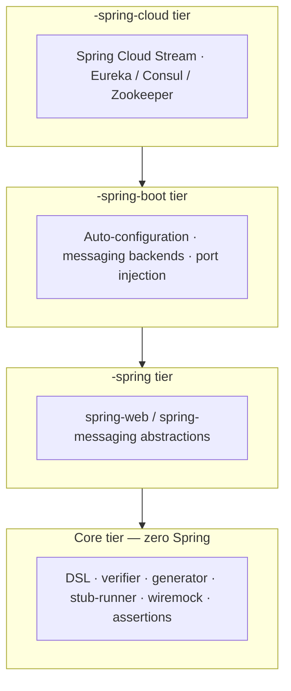

# Modules & Architecture

Stubborn Contract is a multi-module Maven build. Every module publishes under the
`sh.stubborn` group id and the same version (`0.1.0-SNAPSHOT` on `main`). You rarely
depend on individual modules directly — the [BOM and starters](../getting-started/installation)
pull in the right set for you. This page explains how the modules are layered so you know
what each one is for and which tier you are allowed to depend on.

## The tier model

Modules are organised into four concentric tiers. Each tier may only depend on the tiers
below it. The boundary is not just convention — it is enforced on every build by the Maven
Enforcer rule `ban-spring-in-core` and by the ArchUnit `CoreModuleArchTest`.

| Tier | Suffix | Allowed dependencies |
|------|--------|----------------------|
| **Core** | *(none)* | JDK, SLF4J, Groovy (spec only), commons-text, WireMock, XmlUnit |
| **Spring Framework** | `-spring` | core + `spring-web` / `spring-messaging` |
| **Spring Boot** | `-spring-boot` | `-spring` + `spring-boot-autoconfigure` |
| **Spring Cloud** | `-spring-cloud` | `-spring-boot` + `spring-cloud-*` |

::: tip Why a zero-Spring core?
Keeping the core free of Spring means the contract DSL, the test generator, the stub runner
and the assertion helpers can be embedded in non-Spring builds (plain JUnit, Gradle, the Maven
plugin, even non-JVM tooling via the JSON/YAML contract format). Spring is a convenience layer
added on top, never a hard requirement of the engine.
:::

## Core tier (zero Spring)

| Module | Purpose |
|--------|---------|
| `stubborn-jsonassert` | Fluent JSON assertion helpers used by generated tests. |
| `stubborn-xmlassert` | XML assertion helpers (built on XmlUnit). |
| `stubborn-contract-spec` | Aggregator for the contract specification API. |
| `stubborn-contract-spec-java` | Java DSL for writing contracts (`Contract.make { … }` equivalents in Java). |
| `stubborn-contract-spec-groovy` | Groovy DSL for writing contracts. |
| `stubborn-contract-verifier` | **Runtime / shared library** of the verifier — the contract model, converters, matchers and stub-generation logic reused at both build time and test time. |
| `stubborn-contract-generator` | **Build-time test generator.** Renders the actual test source for each contract and carries the [JavaPoet](https://github.com/palantir/javapoet) dependency (`com.palantir.javapoet:javapoet`). |
| `stubborn-contract-stub-runner` | Stub runner core — downloads, unpacks and serves stubs. |
| `stubborn-contract-wiremock` | WireMock integration core (no Spring). Registers the custom matchers. |
| `stubborn-contract-converters` | Contract format converters (YAML ⇄ Java ⇄ Groovy). Lives under `stubborn-contract-tools/`. |

### The generator / verifier split

Historically a single `verifier` module both **modelled** contracts and **rendered** test
source. Those two concerns are now separate modules:

- **`stubborn-contract-verifier`** is the runtime and shared library. It is on the compile
  classpath of downstream Spring modules and is checked by `revapi` for binary compatibility.
  It does **not** carry JavaPoet.
- **`stubborn-contract-generator`** is the build-time test generator. It depends on
  `stubborn-contract-verifier` and adds JavaPoet (`JavaPoetTestRenderer`) plus the messaging
  code generators. It is invoked by the Maven / Gradle plugins during the build and is not
  something a consumer application depends on at runtime.

This keeps the heavyweight code-generation dependency out of the runtime classpath while still
letting the plugins generate tests.

## Spring Framework tier (`-spring`)

Depends on core plus `spring-web` / `spring-messaging` only — no Spring Boot.

| Module | Purpose |
|--------|---------|
| `stubborn-contract-verifier-spring` | Messaging abstractions: `ContractVerifierMessage`, `MessageVerifierSender` / `MessageVerifierReceiver`. |
| `stubborn-contract-stub-runner-boot` | Spring Framework stub-runner integration. |
| `stubborn-wiremock-spring` | Spring MVC / RestTemplate / REST Docs WireMock helpers (`WireMockRestServiceServer`, `WireMockRestDocs`, `WireMockWebTestClient`). |

## Spring Boot tier (`-spring-boot`)

Adds `spring-boot-autoconfigure` and the concrete messaging backends.

| Module | Purpose |
|--------|---------|
| `stubborn-contract-verifier-spring-boot` | `@AutoConfigureMessageVerifier` and all messaging backends — `integration`, `jms`, `camel`, `avro` (plus a `noop` backend). |
| `stubborn-contract-stub-runner-spring-boot` | `@AutoConfigureStubRunner`, port injection, stub-runner auto-configuration. |
| `stubborn-wiremock-spring-boot` | Spring Boot WireMock auto-configuration (`WireMockRestTemplateConfiguration`). |

## Spring Cloud tier (`-spring-cloud`)

| Module | Purpose |
|--------|---------|
| `stubborn-contract-verifier-spring-cloud` | Spring Cloud Stream messaging verifier. |
| `stubborn-contract-stub-runner-spring-cloud` | Eureka / Consul / Zookeeper service discovery for the stub runner. |

## Infrastructure & tooling

| Module | Purpose |
|--------|---------|
| `stubborn-contract-dependencies` | Consumer **BOM** — import once, get consistent versions of every `sh.stubborn:*` artifact and the managed third-party versions. |
| `stubborn-contract-starters` | Convenience starters: `stubborn-starter-contract-verifier`, `stubborn-starter-contract-stub-runner`. |
| `stubborn-contract-tools` | Houses `stubborn-contract-maven-plugin` and `stubborn-contract-converters`. |
| `stubborn-extras` | Kotlin DSL (`stubborn-spec-kotlin`) and the Gradle plugins (`stubborn-contract-gradle-plugin`, id `sh.stubborn.contract`; `stubborn-contract-gradle-portal-plugin`). Designed to be extractable to a separate repo. |
| `stubborn-migration` | [OpenRewrite recipes](../migration/from-spring-cloud-contract) for migrating from Spring Cloud Contract. |
| `stubborn-messaging-kafka` | Kafka messaging support (`sh.stubborn.messaging.kafka`). |

## Module boundary rules

The boundary between tiers is gated automatically:

- **Maven Enforcer — `ban-spring-in-core`** fails the build if any core module declares a
  Spring dependency.
- **ArchUnit — `CoreModuleArchTest`** fails if core code imports a Spring type.
- Core modules must log through **SLF4J** (`org.slf4j.Logger` / `LoggerFactory`), never
  `org.apache.commons.logging`.

If you contribute code, put it in the lowest tier that can hold it, and never reach "up" a
tier for a dependency.

## API compatibility

The core, Spring-free modules are covered by the `revapi-maven-plugin`, which runs on every PR.
Breaking changes to `public` / `protected` methods, constructors or types in these modules
require an explicit `revapi` justification in the module's `pom.xml`:

`stubborn-contract-verifier`, `stubborn-contract-stub-runner`, `stubborn-contract-wiremock`,
`stubborn-contract-converters`, `stubborn-jsonassert`, `stubborn-xmlassert`.

Modules with a `-spring`, `-spring-boot` or `-spring-cloud` suffix are **not** under `revapi`
and may evolve more freely.

## See also

- [Installation & Coordinates](../getting-started/installation) — how to actually depend on all this
- [Migration from Spring Cloud Contract](../migration/from-spring-cloud-contract)
- [Messaging Contracts](./messaging-contracts) · [WireMock Helpers](./wiremock) · [Stub Runner](./stub-runner)
