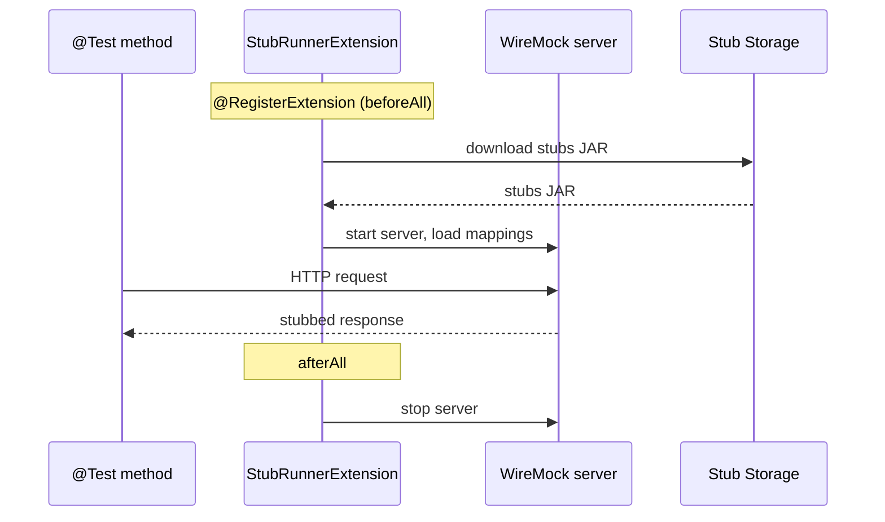

# Stub Runner — JUnit 5

Stub Runner downloads and starts stubs so your consumer tests can run against realistic WireMock servers without a live producer.



## Quick start

### 1. Add the dependency

::: code-group

```xml [Maven]
<dependency>
  <groupId>sh.stubborn</groupId>
  <artifactId>stubborn-starter-contract-stub-runner</artifactId>
  <scope>test</scope>
</dependency>
```

```groovy [Gradle]
testImplementation 'sh.stubborn:stubborn-starter-contract-stub-runner'
```

:::

### 2. Annotate your test

```java
@SpringBootTest(webEnvironment = SpringBootTest.WebEnvironment.NONE)
@AutoConfigureStubRunner(
    ids = "sh.stubborn:order-service:+:stubs",
    stubsMode = StubsMode.LOCAL
)
class OrderConsumerTest {

    @StubRunnerPort("sh.stubborn:order-service")
    int orderServicePort;

    @Test
    void should_get_order() {
        RestTemplate restTemplate = new RestTemplate();
        ResponseEntity<String> response = restTemplate.getForEntity(
            "http://localhost:" + orderServicePort + "/orders/1",
            String.class
        );
        assertThat(response.getStatusCode()).isEqualTo(HttpStatus.OK);
    }
}
```

## `@AutoConfigureStubRunner` reference

| Attribute | Default | Description |
|---|---|---|
| `ids` | required | Stub coordinates: `groupId:artifactId[:version[:classifier]][:port]` |
| `stubsMode` | `CLASSPATH` | Where to resolve stubs: `LOCAL`, `REMOTE`, `CLASSPATH` |
| `repositoryRoot` | — | Maven repo URL for `REMOTE` mode |
| `minPort` | `10000` | Minimum port for auto-assigned stub ports |
| `maxPort` | `15000` | Maximum port for auto-assigned stub ports |
| `generateStubs` | `false` | Generate stubs from contracts on the classpath |
| `httpServerStubConfigurer` | — | Class to customize the WireMock server |

## Stub coordinates

The `ids` attribute accepts one or more coordinates separated by commas:

```
groupId:artifactId:version:classifier:port
```

Wildcards and shortcuts:

| Example | Meaning |
|---|---|
| `sh.stubborn:order-service` | Latest local snapshot |
| `sh.stubborn:order-service:+` | Latest version (local or remote) |
| `sh.stubborn:order-service:1.0.0:stubs:8090` | Exact version, port 8090 |
| `sh.stubborn:order-*` | All artifacts matching the pattern |

## Port injection

Retrieve the port Stub Runner assigned to a stub:

### `@StubRunnerPort` annotation

```java
@StubRunnerPort("sh.stubborn:order-service")
int orderServicePort;
```

### `StubFinder` bean

```java
@Autowired
StubFinder stubFinder;

int port = stubFinder.findStubUrl("sh.stubborn", "order-service").getPort();
```

## Stubs mode

| Mode | Behaviour |
|---|---|
| `LOCAL` | Resolve from `~/.m2/repository` only |
| `REMOTE` | Resolve from the configured `repositoryRoot` (Maven Central, Nexus, etc.) |
| `CLASSPATH` | Load stubs from the test classpath (useful when stubs are in the same repo) |

### Classpath mode example

Package stubs in the producer repo under `src/main/resources/stubborn-stubs/` and depend on the producer artifact in test scope:

```java
@AutoConfigureStubRunner(
    ids = "sh.stubborn:order-service:+:stubs",
    stubsMode = StubsMode.CLASSPATH
)
```

## JUnit 5 extension (without Spring)

For non-Spring tests, use the `StubRunnerExtension`:

```java
class OrderServiceContractTest {

    @RegisterExtension
    static StubRunnerExtension stubRunnerExtension = new StubRunnerExtension()
        .repoRoot("classpath:m2repo/repository/")
        .stubsMode(StubsMode.LOCAL)
        .downloadStub("com.example", "order-service");

    @Test
    void should_return_order() {
        URL stubUrl = stubRunnerExtension.findStubUrl("order-service");
        // WireMock running at stubUrl
    }
}
```

## Customizing WireMock

Implement `HttpServerStubConfigurer` to add WireMock extensions, change ports, or modify configuration:

```java
public class MyWireMockConfigurer implements HttpServerStubConfigurer {
    @Override
    public WireMockConfiguration configure(WireMockConfiguration config, HttpServerStubConfiguration httpServerStubConfiguration) {
        return config.extensions(new ResponseTemplateTransformer(false));
    }
}
```

Register via `@AutoConfigureStubRunner(httpServerStubConfigurer = MyWireMockConfigurer.class)`.

## Triggering messaging stubs

For messaging contracts, use `StubTrigger` to fire the stub's label:

```java
@Autowired
StubTrigger stubTrigger;

@Test
void should_receive_order_event() {
    stubTrigger.trigger("triggerNewOrder");
    // assert Kafka/AMQP consumer side effects
}
```

## See also

- [Stub Runner Spring Boot](./stub-runner-spring-boot)
- [Stub Runner Reference](./stub-runner)
- [Messaging Contracts](./messaging-contracts)
